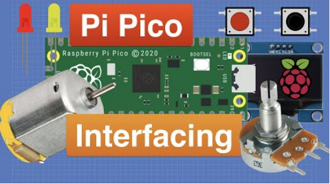
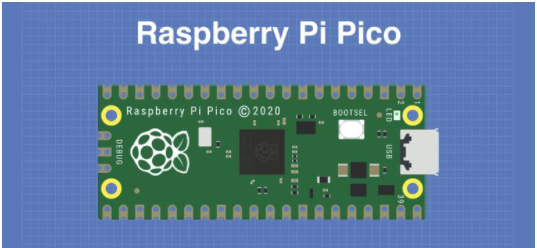

# **Keyestudio Raspberry Pi Pico 42 in 1 Sensor Kit**

## Download Resources

[https://fs.keyestudio.com/KS3024](https://fs.keyestudio.com/KS3024)

## Description

The Keyestudio Raspberry Pi Pico 42 in 1 sensor kit mainly contains 37 commonly used sensors/modules, a Raspberry Pi Pico board, a Raspberry Pi Pico expansion board and Dupont wires.

The 42 sensors and modules are fully compatible with the Raspberry Pi Pico shield. You only need to stack the Raspberry Pi Pico board onto the Raspberry Pi Pico shield, and hook up them with Dupont wires, which is simple and convenient.

To make you master the electronic knowledge, detailed tutorials (Micropython), schematic diagrams, wiring methods and test code are included. Through these projects, you will have a better understanding about programming, logic and electronics.

## Kit

|  #   |         Picture         |                            Name                            | QTY  |
| :--: | :---------------------: | :--------------------------------------------------------: | :--: |
|  1   |   |                Keyestudio Purple LED Module                |  1   |
|  2   |   |            Keyestudio Common Cathode RGB Module            |  1   |
|  3   |   |              Keyestudio Traffic Lights Module              |  1   |
|  4   |   |                  Keyestudio Active Buzzer                  |  1   |
|  5   |   |           Keyestudio 8002b Audio Power Amplifier           |  1   |
|  6   |   |                  Keyestudio Button Module                  |  1   |
|  7   |   |                   Keyestudio Tilt Sensor                   |  1   |
|  8   |   |                Keyestudio PIR Motion Sensor                |  1   |
|  9   |   |            Keyestudio Obstacle Avoidance Sensor            |  1   |
|  10  |  |                 Keyestudio 6812 RGB Module                 |  1   |
|  11  |  |              Keyestudio NTC-MF52AT Thermistor              |  1   |
|  12  |  |                  Keyestudio Photoresistor                  |  1   |
|  13  |  |                  Keyestudio Sound Sensor                   |  1   |
|  14  |  |               KeyestudioRotary Potentiometer               |  1   |
|  15  |  |                   Keyestudio IR Receiver                   |  1   |
|  16  |  |               Keyestudio Reed Switch Sensor                |  1   |
|  17  |  |              Keyestudio Rotary Encoder Module              |  1   |
|  18  |  |                 Keyestudio Joystick Module                 |  1   |
|  19  |  |          Keyestudio HT16K33 8X8 Dot Matrix Module          |  1   |
|  20  |  |           Keyestudio TM1650 4-Digit Tube Display           |  1   |
|  21  |  |            Keyestudio Thin-film Pressure Sensor            |  1   |
|  22  |  |               Keyestudio DS1307 Clock Sensor               |  1   |
|  23  |  |             Keyestudio SR01 Ultrasonic Sensor              |  1   |
|  24  |  |                        9G 90° Servo                        |  1   |
|  25  |  |                Keyestudio Capacitive Sensor                |  1   |
|  26  |  |                Keyestudio Photo Interrupter                |  1   |
|  27  |  |                   Keyestudio Hall Sensor                   |  1   |
|  28  |  |                  Keyestudio Flame Sensor                   |  1   |
|  29  |  |              Keyestudio line Tracking Sensor               |  1   |
|  30  |  |                Keyestudio Analog Gas Sensor                |  1   |
|  31  |  |      Keyestudio XHT11 Temperature and Humidity Sensor      |  1   |
|  32  |  |            Keyestudio 18B20 Temperature Sensor             |  1   |
|  33  |  |                    keyestudio 130 Motor                    |  1   |
|  34  |  |                            Fan                             |  1   |
|  35  |  |                  Keyestudio Laser Module                   |  1   |
|  36  |  |                  Keyestudio Steam Sensor                   |  1   |
|  37  |  |               Keyestudio Ultraviolet Sensor                |  1   |
|  38  |  |                   Keyestudio RFID Module                   |  1   |
|  39  |  |                Keyestudio Collision Sensor                 |  1   |
|  40  |  |                 Keyestudio Alcohol Sensor                  |  1   |
|  41  |  |              Kyestudio LCD_128X32_DOT Module               |  1   |
|  42  |  |                 5-Channel AD Button Module                 |  1   |
|  43  |  |                 DXL345 Acceleration Module                 |  1   |
|  44  |  |                  Raspberry Pi Pico Board                   |  1   |
|  45  |  |        Keyestudio Raspberry Pico IO Expansion Board        |  1   |
|  46  |  | Keyestudio JMFP-4 17-Key Remote Control(without batteries) |  1   |
|  47  |  |                         USB Cable                          |  1   |
|  48  |  |                      F-F Dupont Wire                       |  1   |
|  49  |  |                         White Card                         |  1   |
|  50  |  |                        ABS RFID Key                        |  1   |

## Raspberry Pi Pico & Thonny

At the end of January 2021, the Raspberry Pi Foundation launched the Raspberry Pi Pico, which received a lot of attention due to its high-performance and low-cost.

The size of Pico is 21mm \*51mm, which is similar to Arduino Nano.

Raspberry Pi Pico is a low-cost, high-performance microcontroller board with flexible digital interfaces. It integrates the RP2040 microcontroller chip designed by Raspberry Pi, with dual-core Arm Cortex M0+ processor running up to 133 MHz, embedded 264KB of SRAM and 2MB of on-board Flash memory, as well as 26 multi-function GPIO pins. For software development, either Raspberry Pi's C/C++ SDK, or the MicroPython is available. In this tutorial, we will use MicroPython.

The bare board does not come with pins and you need to solder yourself. This is a well-made board that can also be used as an SMD component and soldered directly to a printed circuit board.

The most predominant feature on the board is the microUSB connector at one end. This is used both for communication and to supply power to the Pico. An on-board LED is mounted next to the microUSB connector, it is internally connected to GPIO pin 25. It’s worthwhile to note that this is the only LED on the entire Pico board. 

The BOOTSEL pushbutton switch is mounted a bit down from the LED, it allows you to change the boot mode of the Pico so that you can load MicroPython onto it and perform drag-and-drop programming.

At the bottom of the board, you’ll see three connections, these are for a serial Debug option that we won’t be exploring here.

In the center of the board is the brains of the whole thing, the RP2040 MCU, which is capable of supporting up to 16MB of off-chip Flash memory, although in the Pico there is only 4MB.

  - Dual-core 32-bit Arm Cortex M0+ processor

  - Runs at 48MHz, but can be overclocked to 133MHz

  - 30 GPIO pins

  - Can support USB Host or Device mode

  - 8 Programmable I/O(PIO) state machines

The Pico is a 3.3V logic device, however, it can be powered with a range of power supplies thanks to a built-in voltage converter and regulator.

**GND:** Ground connection. 8 grounding wires plus an additional one on the 3-pin Debug connector. They are square as opposed to rounded like the other connections.

**VBUS:** This is the power from the microUSB bus, 5 V. If the Pico is not being powered by the microUSB connector then there will be no output here.

**VSYS:** This is the input voltage, which can range from 2 to 5V. The on-board voltage converter will change it to 3.3V for the Pico.

**3V3:** This is a 3.3V output from the Pico’s internal regulator. It can be used to power additional components, providing you keep the load under 300ma.

**3V3\_EN:** You can use this input to disable the Pico’s internal voltage regulator, which will shut off the Pico and any components powered by it.

**RUN:** It can enable or disable the RP2040 microcontroller, it can also reset it.

There are 26 exposed GPIO connections on the Raspberry Pi Pico board.They are laid out pretty-well in order, with a“gap”between GP22 and GP26 (those“missing”pins are used internally). All these pins have multiple functions, and you can configure up to 16 of them for PWM. There are two I2C buses, two UARTs, and two SPI buses, these can be configured to use a wide variety of GPIO pins. 

The Pico has three Analog-to-Digital Converters, they are ADC0-GP26, ADC1-GP27, ADC2-GP28, and plus ADC-VREF converter used internally for an on-board temperature sensor. Note: The ADCs have a 12-bit resolution. However, the Micropython has scaled the 12-bit resolution into a 16-bit resolution, which means that we will receive ADC values from 0 to 65535. The microcontroller’s working voltage is 3.3V, indicating that 0 corresponds to 0V and 65535 corresponds to 3.3V.

You can also provide an external precision voltage-reference on the ADC_VREF pin. One of the grounds, the ADC_GND on pin 33 is used as a ground point for that reference.

|               Raspberry Pi Pico Configuration                |
| :----------------------------------------------------------: |
|              Dual-core Arm Cortex-M0 + @ 133MHz              |
|                  2 × SPI, 2 × I2C, 2 × UART                  |
|       264KB of SRAM, and 2MB of on-board Flash memory        |
|                       16 PWM channels                        |
| QSPI bus controller, supporting up to 16 MB of external Flash memory |
|             USB 1.1 with host and device support             |
|                        DMA controller                        |
| 8 × Programmable I/O (PIO) state machines for custom peripheral support |
| 30 GPIO pins, 4 of which can optionally be used as analog inputs |
|    Drag-and-drop programming using mass storage over USB     |

 **Pin out**

 

Raspberry Pi did release a ton of technical documentation, plus a great guide called **Get Started with MicroPython on Raspberry Pi Pico**.  It’s available in softcover, and as a PDF download as well. For more information, please refer to:

[https://www.raspberrypi.com/products/raspberry-pi-pico/](https://www.raspberrypi.com/products/raspberry-pi-pico/)

